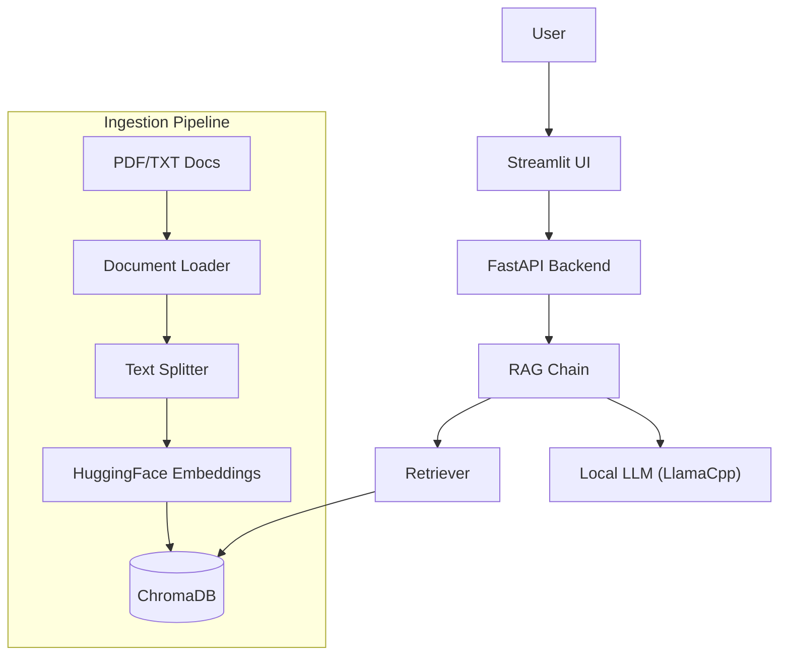

Why I Built a Private, Local-First Legal AI (And Why You Should Too)

*By [Your Name]*

In the rush to slap a "Powered by AI" sticker on everything, we’ve lost the plot.

As an AI architect who has spent years bridging the gap between bleeding-edge research and actual, shippable products, I see the same pattern repeat itself. A law firm or a healthcare provider wants to leverage LLMs. They see the magic of ChatGPT. They want that magic on their own data.

But then comes the blocker: **Privacy.**

You cannot paste a non-disclosure agreement or a sensitive litigation strategy into a public model API. You just can’t. I don’t care what the SOC2 report says; if the data leaves your perimeter, you have increased your attack surface.

For the legal industry, this isn't just a "nice to have." It's an ethical mandate.

So, I decided to build a solution. Not a wrapper around OpenAI. Not a "private cloud" that still requires internet access. I wanted a true, air-gapped, local-first RAG (Retrieval-Augmented Generation) system that runs on your own hardware.

Here is how I architected a private legal chat bot using Mistral 7B, LangChain, and Docker—and why this "Local LLMOps" approach is the future of enterprise AI.

---

## The Architecture of Sovereignty

When you strip away the hype, an LLM application is just a data pipeline. For this project, the constraints were clear:
1.  **Zero Data Exfiltration**: No API calls to the outside world.
2.  **Verifiable Accuracy**: It must cite its sources (RAG).
3.  **Deployable Anywhere**: From a high-end laptop to an on-prem server.

Here is the stack I chose to meet those constraints:

### 1. The Brain: Quantized Local Models
We used **Mistral 7B Instruct**, specifically the quantized version (GGUF format). Why? because running a full 16-bit model requires massive GPU VRAM that most firms don't have. By using 4-bit quantization, we can run a highly capable model on a standard consumer GPU or even a decent CPU with acceptable latency.

We orchestrated this with `llama-cpp-python`, which provides Python bindings for the C++ implementation of Llama. It’s lightweight, fast, and doesn't require a complex PyTorch install just to run inference.

### 2. The Memory: Local Vector Store
For the RAG pipeline, we need to turn legal docs into math (vectors). We used `sentence-transformers` with the `all-MiniLM-L6-v2` model. It’s small, fast, and runs entirely locally.

For storage, I chose **ChromaDB**. It’s open-source, file-based, and doesn't require spinning up a separate heavy database container like Postgres/pgvector for a simple deployment. It lives right alongside the app.

### 3. The Nervous System: FastAPI & LangChain
I’m a product guy. I know that a Python script isn't a product. An API is.
We wrapped the logic in **FastAPI**. This decouples the intelligence from the interface. Today, the UI is Streamlit. Tomorrow, it could be a plugin for a legal case management system.

### The Diagram
Here is what it looks like under the hood:

---

## The "Aha" Moment: Ingestion is Everything

The code for the chat interface is surprisingly simple. The real engineering challenge in LLMOps is **Ingestion**.

Legal documents are messy. They have headers, footers, weird formatting, and scanned pages. In our `ingest.py`, we used `PyPDFLoader` and `RecursiveCharacterTextSplitter`.

Why recursive? Because legal concepts don't break cleanly at 500 characters. You need a splitter that respects paragraph boundaries and sentence structures. If you chop a contract clause in half, the LLM loses the context of the "Subject to..." condition, and your legal advice becomes hallucination.

We set a chunk size of 1000 tokens with a 200-token overlap. This ensures that when the retriever pulls context, it grabs enough surrounding text to make sense of the clause.

## Why This Matters

We are moving from an era of "AI as a Service" to "AI as a Component."

When you build this way, you own the stack. You aren't renting intelligence; you are hosting it.
-   **Cost**: You pay for electricity, not per-token API fees.
-   **Latency**: No network round-trips.
-   **Privacy**: Absolute.

This project wasn't just about writing code. It was about proving that you don't need Big Tech's cloud to build powerful, useful tools.

For the legal field, this is the difference between "we're thinking about AI" and "we're using AI."

## The Code

I’ve open-sourced the entire architecture. You can find the Dockerized setup, the ingestion scripts, and the API structure on my GitHub.

[Link to GitHub Repo]

Go build something that protects your users.
